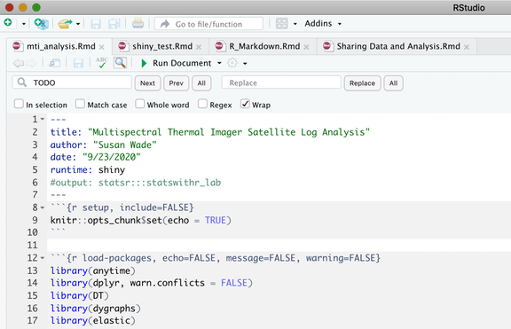
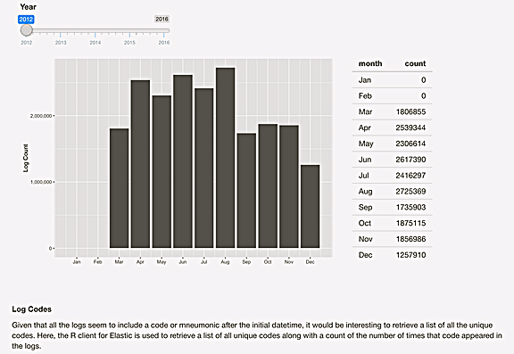

## The Problem
 

R, RStudio, RMarkdown, Shiny, and associated tools are powerful but how can data analysis and results be easily shared with others? 

## The Goal   
 
Share documentation, code, analysis results, visualizations, and discussion content with others in a way that doesn't require everyone to download R, RStudio, R packages, and Elastic.  

## What Kind of Data Analysis and Results are we Talking About?
Documentation, text, code, and interactive apps written in RMarkdown and combined into html, pdf, or slide format.

 

 

## Document Introduction 
  

## Interactive Shiny App in the same document

  

  

## Why not just use Kibana?
**Pros** | **Cons**
------------- | ----------------
| Visualizations | **Kibana analysis is limited**  |
| Interactive | **Using Kibana isn't very intuitive** |
| Real time data updates | **Kibana report generation options are limited** |

## Sharing Options

- Email
- GitLab Pages
- RStudio Shiny server
- Shinyapps.io
- Docker

## Email

- Ok for static content
- Doesn't work for interactive/dynamic content

## GitLab Pages

- GitLab Pages can be used to host a website based on GitLab repo contents
- [GitHub Pages Example](https://swade1.github.io/Week2/index.html)
- [GitHub Pages Slide Show Example](https://swade1.github.io/Week3/Week3Assignment.html#1)

- _This works well for static content but dynamic content is not supported_

## RStudio Shiny server
Whenever we talk about dynamic content, we're talking about content generated using Shiny

What is Shiny?   

- Shiny is an R package that makes it easy to build interactive web apps straight from R.  
- Standalone Shiny apps can be: 
  - Hosted on a webpage
  - Embedded in R Markdown documents, or 
  - Used to build dashboards

Shiny app content can be hosted on an RStudio Linux server that approved users can access

## Share Shiny apps online with Shinyapps.io

- No server to set up and configure
- No hardware, installation, or annual purchase contract required
- Free, limited basic account up to $300/mo for professional level
- Shiny apps run in protected environment with SSL encrypted access
- [shinyapps.io Example](https://swade1.shinyapps.io/Week4AssignmentPresentation/#1)

## Docker 
- rocker/rstudio image available at https://hub.docker.com/r/rocker/rstudio   
- Runs on all platforms  
- Users need not download R, R packages, RStudio, etc. 
- Can be configured to include Elastic and pre-populated indices  
- Users can run Shiny apps locally

## Links and Resources
- [Shiny Documentation](shiny.rstudio.com)
- [GitHub Pages Documentation](pgges.github.com)
- [Setting up a Shiny Server - Part 1](r-bloggers.com/2017/04/shiny-server-series-part-1-setting-up/)
- [Setting up a Shiny Server - Part 2](r-bloggers.com/2017/04/shiny-server-series-part-2-running-shiny-on-multiple-ports)
- [Setting up a Shiny Server - Part 3](r-bloggers.com/2017/04/shiny-server-series-part-3-adding-ssl-encryption/)
- [Setting up a Shiny Server - Part 4](r-bloggers.com/2017/04/shiny-server-series-part-4-adding-user-authentication-using-auth0/)
- [Share your Shiny apps online with shinyapps.io](shinyapps.io)
- [The rocker/rstudio Docker image](hub.docker.com/r/rocker/rstudio)

